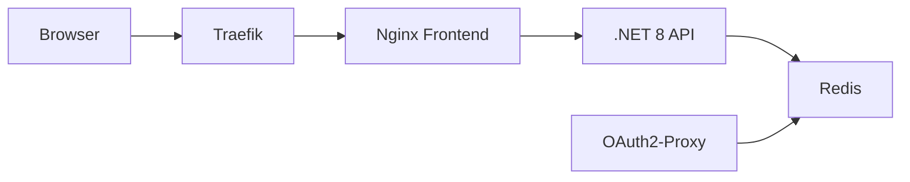

# Session Manager

A simple tool to manage OAuth2-proxy sessions stored in Redis. I built this for my home lab at [josnelihurt.me](https://www.josnelihurt.me) to have a quick way to see who's logged in and kick them out if needed.

**Use this code at your own risk.**

## What it does

OAuth2-proxy keeps sessions in Redis. This gives you a web UI to:
- See all active sessions
- Check when they expire
- Delete individual sessions (logout specific users)
- Nuke all sessions at once (global logout)

## Architecture



The frontend talks to the API through nginx reverse proxy, and the API reads/deletes keys from the same Redis instance that OAuth2-proxy uses.

## Stack

- **Backend**: .NET 8, StackExchange.Redis
- **Frontend**: React 18, Vite
- **Infra**: Docker, Traefik

## Quick Start

```bash
# If using with josnelihurt.me infra
cd /home/jrb/code/infra
./scripts/vultur/deploy_session_manager.sh
```

Access at `https://session-manager.lab.josnelihurt.me`

## Local Dev

Backend:
```bash
cd src/SessionManager.Api
dotnet run
# API at http://localhost:5000
```

Frontend:
```bash
cd frontend
npm install && npm run dev
# UI at http://localhost:5173
```

## Config

| Variable | Default | What it does |
|----------|---------|-------------|
| `Redis__ConnectionString` | `redis://oauth2-redis:6379` | Redis connection |
| `FrontendUrl` | `https://session-manager.lab.josnelihurt.me` | CORS origin |

## API

```http
GET  /api/sessions          # List all sessions
DELETE /api/sessions/{key}  # Delete one session
DELETE /api/sessions        # Delete all sessions
```

## How OAuth2-proxy stores sessions

When configured with `--session-store-type=redis`, OAuth2-proxy creates keys like:
```
_oauth2_proxy_redis-abc123xyz
```

The session data is encrypted, so we can only see the session ID and TTL, not the user email.

## Project Structure

```
session-manager/
  src/SessionManager.Api/     # .NET API
    Controllers/              # REST endpoints
    Services/                 # Redis logic
  frontend/                   # React app
  Dockerfile                  # API container
  frontend/Dockerfile         # Frontend container
```

## Security Note

This tool has no auth built in. Put it behind OAuth2-proxy or something similar. It has full delete access to sessions.

## Related

Part of [josnelihurt.me infra](https://github.com/josnelihurt/infra) - my home lab setup.
# CICD test
